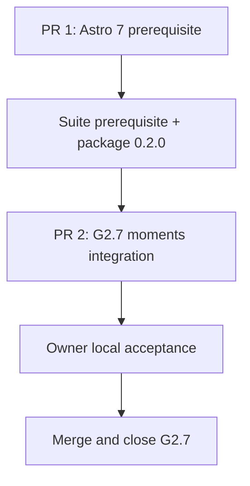
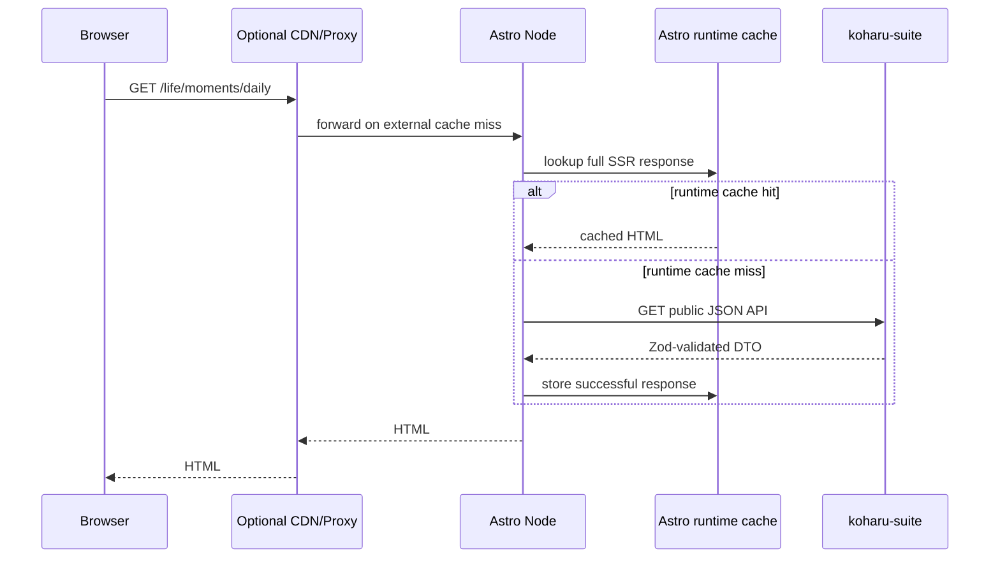

# G2.7 可选碎碎念动态归档设计文档

> 作者：Codex 与项目 Owner ｜ 日期：2026-07-25 ｜ 状态：Implementation in Progress

> [!IMPORTANT]
> 本文的设计树已经完成 `batch-grill-me` 收敛，产品与技术边界已由 Owner 逐轮确认。
> Owner 已于 2026-07-25 确认按 Stage A → Stage B → Stage C 执行，本文现在是 G2.7 的实施基线。

## 1. 背景与问题（Context）

astro-koharu 当前是纯静态 Astro 站点：

- `astro.config.mjs:176-224` 没有配置 output adapter，所有既有页面按静态构建运行；
- `src/content.config.ts:1-60` 只注册基于 glob 的 Git blog collection；
- `docker/Dockerfile:29-48` 把完整 `dist` 复制给 nginx，没有 Node SSR runtime；
- `config/site.yaml:371-409` 通过数组顺序维护站点导航；
- `src/layouts/Layout.astro:15-54` 已统一挂载 Header、主题、Search、Lightbox、Settings 和全局样式；
- `src/layouts/TwoColumnLayout.astro:16-25` 提供现有归档类页面使用的 Cover、Sider、正文与 Footer 骨架。

koharu-suite G2.6 已发布 `@coszone/koharu-astro@0.1.0`，提供：

- 公开频道与消息的 Zod schema；
- typed read client；
- Astro Live Content Collection loaders；
- 稳定错误归一化；
- suite RSS 与媒体 URL helper。

G2.7 要解决的不是“把 Telegram 内容转换成 Markdown”，而是让 astro-koharu 在显式启用时，
以运行时页面消费 koharu-suite 的公开频道内容。用户看到的产品名称是“碎碎念”，Telegram
只是内容来源。

跨仓跟踪：

- astro-koharu tracking issue：
  <https://github.com/cosZone/astro-koharu/issues/199>
- koharu-suite Roadmap：
  <https://github.com/cosZone/koharu-suite/issues/1>
- G2.6 adapter Goal：
  <https://github.com/cosZone/koharu-suite/issues/28>

### 1.1 为什么现在做

Astro 6/7 Live Content Collections 允许只在 on-demand route 的请求阶段读取外部数据，因此可以同时保留：

1. Git Markdown 文章的静态生成；
2. Telegram 消息的运行时更新；
3. suite 未启用时的纯 nginx 部署；
4. suite 故障只影响碎碎念路由的隔离边界。

### 1.2 当前事实约束

公开 API 的实际语义会直接限制 UI：

- channel 只有 `id`、`title` 和可空 `username`；
- channel API 默认按 title、id 排序；
- message feed 只支持 newest-first 和继续读取更旧内容的 opaque cursor；
- message 只有 `publishedAt` 和 `revision`，没有可靠 `editedAt`；
- `sourceUrl` 仅在能构造公开 Telegram URL 时存在；
- `mediaGroupId` 没有被 API 聚合成相册实体；
- media 状态只有 `pending`、`ready`、`unavailable`；
- search snippet 是不可信纯文本，不能作为 HTML 注入；搜索结果正文复用 message 的安全富文本 ViewModel；
- suite 现有 RSS item 链接优先指向 Telegram，缺少 username 时可能指向 suite JSON API；
- typed client 使用 `cache: 'no-store'`，五分钟页面缓存必须由 Astro/CDN response 层承担。

## 2. 目标与非目标（Goals / Non-Goals）

### 2.1 Goals

1. 在 astro-koharu 中交付可选的“碎碎念”动态区域。
2. 默认关闭；关闭时不要求 suite 环境变量、不注册动态 collection/route、不配置 Node adapter、
   不发出 suite 请求。
3. 开启时只让碎碎念路由 on-demand rendering；文章、首页、分类、标签、归档等既有页面继续静态生成。
4. 提供主频道消息流、频道切换、消息详情、cursor 分页、简单搜索和 branded RSS。
5. 复用 astro-koharu 的 Layout、TwoColumnLayout、Cover、HomeSider、design tokens、暗色模式、
   响应式规则、导航和 i18n 机制。
6. 对 404、429、timeout、network、5xx、invalid response、空数据和媒体不可用提供明确降级。
7. 提供 static nginx 与 dynamic Astro Node 两种并存部署方式。
8. 允许配置嵌套页面 path、标题、描述、OG、频道别名、顺序、可见性和主频道。
9. 允许公开索引首页、频道页和消息详情，同时避免索引 search/cursor 页面。
10. 通过单独的 Astro 7 前置 PR 清理框架升级风险，再进入 G2.7。

### 2.2 Non-Goals

1. 不把 Telegram 消息写入 Git Markdown 或 blog collection。
2. 不实现数据库文章发布、Git/DB 双源合并或 Agent 发布。
3. 不实现 Telegram 讨论区评论、私有频道或 MTProto 用户会话。
4. 不把 koharu-suite Admin UI 嵌入博客。
5. 不在 adapter 中注入视觉页面。
6. 不把全站全部改成 SSR。
7. 不在 G2.7 实现真正的 Telegram album group contract。
8. 不自动翻译 Telegram 内容，不复制 `/en`、`/ja` 等相同动态内容。
9. 不在 G2.7 实现统一 OG 图片生成服务，只预留 resolver seam。
10. 不在第一版把 Pagefind 静态搜索与 suite 动态搜索合并成统一结果集。
11. 不用本地 astro-koharu 主仓、worktree 或 astro-koharu-private 作为集成测试 fixture。

## 3. 已确认决策（Decision Log）

| 主题 | 已确认决策 |
|---|---|
| 产品名称 | 用户界面称为“碎碎念”，弱化 Telegram 品牌但不隐藏来源 |
| 默认 path | `moments`，允许配置为 `life/moments` 等嵌套 path |
| path 校验 | 构建期校验非法 segment、保留路由、locale、featured series 和实际 route 冲突 |
| 部署 | static nginx 和 dynamic Astro Node 双模式 |
| Docker | 同一个 Dockerfile 提供 static/dynamic targets；默认仍是 static |
| 配置 | 公开配置放 `config/site.yaml#moments`；suite origin 使用 `KOHARU_SUITE_URL` |
| suite 地址 | 使用浏览器和 Astro Node 都可访问的独立公开 suite origin |
| 页面范围 | 主频道 feed、频道切换、详情、cursor 分页、搜索、全局/频道 RSS |
| locale | 单一 canonical 动态区域，不复制 locale-prefixed 动态路由 |
| SEO | 首页、频道、详情可索引；cursor 为 `noindex,follow`；search 为 `noindex` |
| 缓存 | 默认单实例 `memoryCache`：普通动态页面/RSS 五分钟、搜索 60 秒 |
| 故障 stale | 裸 Node 不承诺 24 小时 stale-on-error；只作为经验证的外部共享缓存能力 |
| 页面布局 | 复用 TwoColumnLayout、HomeSider、Cover 和现有主题系统 |
| 频道默认 | 默认展示所有 public channels；允许配置 override、顺序、hidden 和 primary |
| 频道 ID | Owner Desk 显示并复制 Suite channel ID；无 override 时无需手工配置 UUID |
| hidden | 从博客全部 moments 页面、搜索、RSS 和直接详情排除，不影响 suite 采集 |
| channel slug | 自定义 slug > Telegram username > 完整 suite UUID |
| URL 变更 | username 改名不自动维护旧 URL；生产站建议配置稳定 slug |
| Redirect | path/channel slug 旧值只通过显式 aliases 保留，并返回 308 |
| 消息顺序 | newest-first；保留 SSR cursor 链接，并在浏览器中渐进增强为滚动加载更旧内容 |
| 页面数量 | channel feed 20 条；search 20 条；RSS 50 条；URL 不开放 limit |
| 邻接导航 | package 0.2.0 提供同频道 newer/older context；detail 首版交付 |
| 长消息 | feed 中约 `24rem` 后折叠；详情始终完整 |
| 编辑状态 | `revision > 1` 只显示“已更新”；不显示伪造编辑时间 |
| 相册 | 相邻消息按显式 group 或 Desktop 强信号做展示层聚合；cursor 边界保持独立 |
| 媒体加载 | image lazy；video metadata/no autoplay；audio none；单消息 feed 最多预览 4 个，聚合相册展示全部成员（最多 10 个） |
| 来源链接 | 文案统一为“查看源消息”；`sourceUrl` 为空时不生成假链接 |
| 时间 | 使用站点时区的绝对时间和标准 `<time datetime>` |
| 导航 | 支持 `feature: moments` 占位调序；缺席时默认插入归档之后 |
| OG | 用户配置图片，不自动使用 message 第一张媒体；预留 resolver |
| Astro 版本 | G2.7 前先完成独立 Astro 7 前置 PR |
| adapter | G2.7 前发布 `@coszone/koharu-astro@0.2.0`，支持 Astro 6/7 |
| 数据访问 | channel discovery 使用 Live Collection；cursor/search/context/RSS 使用 typed client |
| 运维 | static 命令不变；增加 dynamic Compose profile/scripts；根 `/` 继续作为 liveness |
| 日志 | 只记录 moments 失败与超过 2 秒的慢请求，不引入 metrics stack |
| 文档 | design、三语 feature guide、deployment overview 和三语 README 入口分层 |

## 4. 约束与假设（Constraints & Assumptions）

### 4.1 静态合同

`moments.enabled: false` 时必须满足：

- 不读取 `KOHARU_SUITE_URL`；
- 不创建 Koharu client；
- 不注册 Live Collections；
- 不注册 moments Astro integration；
- 不注入动态 route；
- 不配置 `@astrojs/node`；
- `astro check`、`astro build` 对 trap suite server 的请求数为 0；
- 当前 static Docker target、nginx config 和静态页面输出继续可用。

### 4.2 动态合同

`moments.enabled: true` 时：

- `KOHARU_SUITE_URL` 必填且在启动/构建配置阶段完成 URL 格式校验；
- 构建不检查 suite 在线状态；
- Astro 保持 `output: 'static'`；
- 只有显式注入的 moments routes 设置 `prerender: false`；
- Node standalone 同时服务 `dist/client` 静态资产和 `dist/server` 动态 route；
- suite 暂时离线不阻止镜像启动。

### 4.3 内容与信任边界

- 只消费 koharu-suite public read API；
- 不向客户端暴露 admin token、database URL 或内部异常；
- `message.content.html` 只按 adapter 已验证的安全 HTML 使用 `set:html`；
- search snippet 不注入页面；搜索结果正文与 feed/detail 共用 message HTML 的 allowlist sanitizer；
- media URL 必须通过 client 基于 suite origin 解析；
- 页面不会把 Telegram 内容标记为博客原创文章。

## 5. 推荐方案（Detailed Design）

### 5.1 交付顺序



#### Stage A：Astro 7 前置 PR

已验证：

- 公开临时 checkout 在 Astro `7.1.3` 下完成 `astro check`；
- 355 个文件为 0 error、0 warning、0 hint；
- Live Content Collections、`output: 'static'` + 局部 on-demand route、`injectRoute()` 架构继续成立。

必须完成：

- `astro@7`、`vite@8`、`@astrojs/react@6` 和对应官方 integration 升级；
- `astro-pagefind@2` SearchPortal、props、CSS 和翻译迁移；
- 删除不支持 Astro 7 的 `@yeskunall/astro-umami`，改为本地输出 script；
- 保留显式 `unified()` Markdown pipeline；
- 保留 `compressHTML: true`；
- 验证 conditionalSnowfall、YAML、SVGR、Tailwind、Sonda 和 Rolldown build；
- 完成真实 `check + build` 和少量关键页面视觉检查。

#### Stage B：koharu-suite prerequisite + `@coszone/koharu-astro@0.2.0`

增加：

```ts
client.messages.latest({
  cursor?: string;
  limit?: number;
  signal?: AbortSignal;
}): Promise<MessagePage>

client.messages.context({
  messageId: string;
  signal?: AbortSignal;
}): Promise<MessageContext>
```

Owner Desk 在已归档频道中显示可辨认的 Suite channel ID 和复制按钮；不新增 API、schema
或 CLI 命令。普通用户省略 `moments.channels` 时不需要填写 UUID。

服务端提供公开的全频道 newest-first cursor page。该接口用于：

- 碎碎念 branded global RSS；
- 不依赖逐频道 N+1 merge 的全局最新数据；
- 保持 existing `messages.list({ channelId })` 语义不变。

服务端同时提供：

```http
GET /api/v1/messages/:id/context
```

返回完整 message 与同频道 `newer` / `older` 引用。邻接沿用 feed 的
`(publishedAt DESC, message UUID DESC)` 排序，排除 tombstone，不跨频道。现有
`(channelId, tombstonedAt, publishedAt, id)` 索引已经覆盖，不需要 schema migration。

package peer：

```json
{
  "peerDependencies": {
    "astro": "^6.0.0 || ^7.0.0"
  }
}
```

不能只放宽 peer 字符串；必须分别运行 Astro 6 和 Astro 7 package fixture。

Stage B 的完成 gate 是：koharu-suite server/package/Admin PR 合并，Changeset release PR 合并，
Trusted Publisher 发布 `0.2.0`，再从 npm registry 安装精确版本完成 smoke。G2.7 不消费 workspace
或 Git dependency。

#### Stage C：G2.7 astro-koharu integration

直接基于 Astro 7 和对应的 `@astrojs/node@11` 实现，不先引入 Astro 6 Node adapter 再迁移。

### 5.2 配置模型

推荐配置：

```yaml
moments:
  enabled: false
  path: moments
  title: 碎碎念
  description: 记录频道中的日常消息
  ogImage: /img/moments-og.png
  pathAliases:
    - telegram
  channels:
    - id: 550e8400-e29b-41d4-a716-446655440000
      slug: daily
      title: 日常
      primary: true
      hidden: false
      ogImage: /img/daily-og.png
      aliases:
        - old-daily
```

```env
KOHARU_SUITE_URL=https://suite.example.com
```

频道规则：

1. `channels` 可以省略；省略时展示 API 返回的全部公开频道。
2. 配置数组中的频道按数组顺序显示。
3. API 新出现但未配置的频道追加在后。
4. `title` 只覆盖博客显示名称。
5. `hidden` 只从博客隐藏，不停止 suite 采集。
6. 最多一个 `primary: true`。
7. 未配置 primary 时使用排序后的第一个可见频道。
8. custom slug、username 或 UUID 发生碰撞时构建失败。
9. `pathAliases` 和 channel `aliases` 只显式保留用户列出的旧 URL，并以 308 跳转到 canonical。
10. alias 同样参加 reserved route、locale、series 和 duplicate validation；不自动维护历史。

`hidden` 表示“该频道不出现在博客的任何 moments 公共入口”：channel switcher、feed、
search、global RSS 和直接 detail URL 都排除；suite 仍继续采集且 public API 本身不改变。
为避免 global latest/search 先取后滤导致漏项，Stage B 让 latest/search 接受有上限的
visible channel IDs filter。

当前 suite 的 public channel API 已返回稳定 suite UUID、title 和 username，但 Owner Desk
只显示 title/username，UUID 只能通过 `curl /api/v1/channels` 取得。并且 suite UUID
要在首条消息归档时才生成，不会在 allowlist 添加频道时提前存在。package 0.2.0 的 Owner Desk
小改动显示“Suite channel ID + 复制”；省略 `channels` 配置的默认流程始终不要求用户手工填写
UUID。`curl /api/v1/channels` 继续作为 headless fallback。

导航：

```yaml
navigation:
  - name: 首页
    path: /
  - feature: moments
    icon: ri:chat-smile-3-fill
  - name: 关于
    path: /about
```

- placeholder 可以出现在一级菜单或 children；
- placeholder 的标题和 path 取 moments 配置；
- moments disabled 时 placeholder 不产生 UI；
- placeholder 缺席时默认注入到归档之后。

### 5.3 Path 与 route 校验

`moments.path` 支持多个安全 segment，例如：

```text
moments
life/moments
notes/daily
```

拒绝：

- 空 path、空 segment、`.`、`..`；
- 前后 `/`、双斜线；
- query、fragment、protocol、反斜线、百分号和 Astro `[]` 参数语法；
- 与 `about`、`categories`、`tags`、`friends`、`post`、`posts`、`archives`、`api`、
  `rss.xml`、sitemap、Astro internals 等命名空间冲突；
- 第一段等于启用的 locale；
- 与 featured series 产生实际 URL 冲突；
- 在 `astro:routes:resolved` 中出现 exact route/pathname duplicate。

推荐显式 route：

| Pattern | 用途 | Rendering |
|---|---|---|
| `/<prefix>` | 主频道 feed + channel switcher | on-demand |
| `/<prefix>/search` | 动态搜索 | on-demand |
| `/<prefix>/rss.xml` | branded global RSS | on-demand endpoint |
| `/<prefix>/<channel-slug>` | 频道 feed | on-demand |
| `/<prefix>/<channel-slug>/rss.xml` | branded channel RSS | on-demand endpoint |
| `/<prefix>/<channel-slug>/<message-uuid>` | message permalink | on-demand |
| configured path/channel aliases | canonical 308 redirect | on-demand, no suite request |

`search` 和 `rss.xml` 为 moments 内部保留 channel slug。fallback username 命中保留值时改用 UUID。

### 5.4 Astro integration

使用 astro-koharu 内部 integration，而不是把 UI 放入 npm adapter：

```ts
export function momentsRoutes(options: MomentsRoutesOptions): AstroIntegration;
```

伪代码：

```ts
export default defineConfig({
  output: 'static',
  integrations: [
    ...existingIntegrations,
    ...(moments.enabled ? [momentsRoutes({ prefix: moments.path })] : []),
  ],
  ...(moments.enabled
    ? {
        adapter: node({ mode: 'standalone' }),
      }
    : {}),
});
```

integration 在 `astro:config:setup` 中为每个页面和 endpoint 分别调用 `injectRoute()`。
不使用 `/<prefix>/[...path]` catch-all，原因是：

- catch-all 会吞掉拼写错误和未来静态子路由；
- 搜索、RSS、频道和详情的参数/错误边界会被集中到一个手工 dispatcher；
- 无法利用 Astro 的静态 segment 优先级；
- 404 与 route-level tests 更难证明。

建议模块边界：

```text
src/features/moments/
├── config/
│   ├── schema.ts
│   ├── resolve.ts
│   └── routes.ts
├── integration/
│   └── momentsRoutes.ts
├── pages/
│   ├── index.astro
│   ├── search.astro
│   ├── channel.astro
│   ├── message.astro
│   ├── global-rss.ts
│   └── channel-rss.ts
├── components/
│   ├── ChannelSwitcher.astro
│   ├── MessageCard.astro
│   ├── MessageBody.astro
│   ├── MediaGallery.tsx
│   ├── MediaAttachment.astro
│   ├── CursorPagination.astro
│   └── MomentsState.astro
├── lib/
│   ├── client.ts
│   ├── cache.ts
│   ├── errors.ts
│   ├── metadata.ts
│   └── urls.ts
└── types.ts
```

具体文件名可以在实现前调整，但必须保持 config、route injection、data access、UI 和 metadata 分层。

Live Collection 与 typed client 的职责：

- `getLiveCollection('koharuChannels')` 用于公开频道发现；
- cursor feed、search、global latest、RSS 使用 typed client，因为 Live Collection result 不能携带
  `nextCursor` / search snapshot 等 envelope metadata；
- message detail 使用 `messages.context()` 一次取得正文与 newer/older，避免再通过
  `getLiveEntry()` 重复请求同一 message；
- moments disabled 时 `src/live.config.ts` 导出空 collection map，不读取 suite URL。

### 5.5 Runtime 数据流



构建阶段不会进入这条数据流。

### 5.6 页面与交互

#### 主页面

- `Layout + Cover + TwoColumnLayout + HomeSider`；
- 主频道消息流；
- Cover 下方为横向滚动 channel chips；
- chip 使用标题首字符 token 色块、频道名称和可选 `@username`；
- 当前频道显示选中状态；
- 页面顶部提供 moments 搜索入口；
- 提供 branded global RSS。

#### Channel feed

- newest-first；
- 一页只读取一个 channel；
- opaque cursor 原样放进下一页 URL；
- 页面底部保留指向下一 cursor 页面的“加载更早内容”普通链接，作为无 JavaScript 与自动加载失败时的回退；
- 浏览器通过 `IntersectionObserver` 渐进增强为滚动加载；
- 浏览器后退承担返回前一 cursor 页；
- cursor 页面 `noindex,follow`。

#### Message card

- 正文使用 safe HTML；
- feed 中视觉高度超过约 `24rem` 时折叠并提供“展开全文”；
- 完整 HTML 已在 DOM 中，不为展开再次请求 API；
- 只在实际 overflow 时显示最小 `aria-expanded` toggle；
- message detail 始终完整；
- 显示 channel、站点时区绝对发布时间；
- `revision > 1` 显示“已更新”；
- 发布时间链接到 permalink；
- 底部提供低强调度“永久链接”；
- source action 文案为“查看源消息”；
- 不把整张卡变成大链接。

#### Message detail

- 使用同一设计系统和 TwoColumnLayout；
- resolved channel slug 对应的 suite channel ID 必须与 message 的 channel ID 相同，否则返回 404；
- 完整正文和 media；
- canonical permalink；
- 404、503、429 等使用完整 site shell；
- 可复制页面 URL，但第一版不提供复杂 share menu。
- 底部提供同频道“较新一条”和“较早一条”；
- 邻接项显示 published time 与最多约 40 个字符的纯文本 preview；
- 无正文时显示“媒体消息”或“空消息”；
- 边界为 null 时不渲染假按钮；
- 不预加载邻接媒体。

#### Search

- 入口在 moments 首页；
- 独立 SSR results route；
- query 至少三个 Unicode characters；
- 默认按 relevance；
- 提供 relevance/newest 切换和 channel filter；
- 第一版没有日期范围表单；
- 结果正文复用 feed/detail 的安全富文本 ViewModel，不把不可信 snippet 作为 HTML 注入；
- 搜索结果继续省略媒体；长正文中的命中词若落在折叠区域外，需要用户展开正文查看；
- 点击结果进入 message detail；
- search route `noindex`；
- runtime cache 最多 60 秒；
- 不把搜索词作为额外 analytics event。

### 5.7 Media

单个 API message 内：

- 1 个 media：按可用宽度展示，不放大低分辨率内容；
- 2 个 media：双列；
- 3–4 个 media：响应式网格；
- feed 最多预览 4 个，更多显示 `+N`；
- detail 展示该 message 的全部 media；
- image 使用 lazy loading，缩略图优先，进入现有 lightbox 后才使用 original；
- video 不 autoplay，使用 `playsinline`、controls、`preload="metadata"` 与可用 thumbnail poster；
- audio 使用 `preload="none"`；
- document/audio 使用紧凑 attachment card，不自动下载；
- 尊重 `prefers-reduced-motion`。

状态：

| `cacheStatus` | UI |
|---|---|
| `ready` | `thumbnailUrl ?? originalUrl`，加载失败切换 unavailable fallback |
| `pending` | “媒体处理中”占位，不显示 broken element |
| `unavailable` | 显示 kind、fileName、fileSize 等 metadata；有 sourceUrl 时提供“查看源消息” |

Telegram album：

- API 仍不创造新的 album entity，每个 public message 保持独立 revision、permalink 和 source link；
- feed/RSS 对相邻同 `mediaGroupId` 消息做展示层合并；Desktop 历史缺少该字段时，只接受同频道、
  同时间、连续 Telegram 来源 ID、全员含媒体、最多一条正文的强信号；
- 相册使用不随 caption 编辑变化的稳定成员 UUID 作为 RSS GUID 锚点；card/RSS link 与正文均跟随含
  caption 的成员，保证 permalink 详情与所见正文一致。每个媒体保留自己的 source link，feed 展示相册的全部成员；
- cursor 前后边界候选不合并，避免把尚未加载的相册成员隐藏；分页原子的完整 album contract 仍需 suite 支持。

### 5.8 Cache 与错误

#### Cache

已核准的 Astro 7.1 事实：

- on-demand page 和 endpoint 可通过 Astro route cache 缓存完整 Response；
- `memoryCache()` 是单进程 LRU，官方只建议用于 single-instance deployment，重启后清空；
- 裸 `@astrojs/node` 不会仅凭 `Cache-Control` 自己缓存 SSR；
- Astro 的 `maxAge` / `swr` 没有 `stale-if-error` 合同，不能把 SWR 宣传成“suite
  故障时保证返回最长 24 小时旧页”；
- 多实例共享缓存需要经实际验证的 CDN、reverse proxy 或自定义 distributed provider；
- route cache 默认使用 path 和排序后的 query 建 key，并排除常见 tracking 参数；
- 动态注入 route 最稳妥的做法是在 route 内只缓存成功响应；404、429 和 503 禁止缓存。

已确认的默认值：

- 单容器 dynamic Compose 使用 `memoryCache({ max: 1000 })`；
- feed、detail 和 RSS：`maxAge: 300`，可使用短 SWR 作为 best-effort latency 优化；
- search：`maxAge: 60`，使用独立短 SWR；
- client fetch 继续 `no-store`；
- query 在进入 search/cache 前 canonicalize，默认 filter/sort 不重复制造 cache key；
- provider 通过 `X-Astro-Cache: HIT | MISS | STALE` 验收；
- 默认单容器在没有可用 cache entry 且 suite 故障时返回 503；
- 24 小时 stale-on-error 只作为配置并验证过的 production proxy/CDN 可选能力，不作为裸
  Node 默认保证；
- 多实例文档要求 shared cache，不声称各进程 `memoryCache` 一致。

页面可常驻低强调度说明“内容可能有最多 5 分钟延迟”。缓存层透明使用 stale 时，Astro HTML
无法可靠知道自己正在被当作 stale 返回，因此不伪造实时离线 banner。

#### HTTP status

| 场景 | Status | 页面 |
|---|---:|---|
| channel/message 不存在 | 404 | site shell + not found |
| suite rate limited | 429 | retry + `Retry-After` |
| timeout/network/5xx | 503 | service unavailable |
| invalid response | 503 | generic unavailable，不泄露 body |
| no visible channels | 200 | empty state |
| empty channel | 200 | channel empty state |
| no search results | 200 | preserve query/filter + clear action |

任何单次失败都不能终止 Node process。

### 5.9 RSS

不直接把 suite 当前 RSS URL 当作最终博客 RSS，因为现有 item `<link>` 可能指向 Telegram 或 suite JSON。

G2.7 生成：

```text
/<prefix>/rss.xml
/<prefix>/<channel-slug>/rss.xml
```

规则：

- feed title/description 使用 moments 或 channel 配置；
- item link 指向提供正文的 astro-koharu message permalink；
- GUID 使用稳定 suite message UUID；相册选用不随 caption 编辑变化的成员 UUID 作为 RSS GUID 锚点；
- pubDate 使用 RSS GUID 锚点成员的 `publishedAt`；
- edit 后 GUID/pubDate 不变，正文按 current revision 更新；
- global feed 使用 `messages.latest()`；
- channel feed 使用 `messages.list({ channelId })`；
- 最多 50 条；
- 五分钟 runtime cache；
- RSS endpoint 不依赖 Telegram、PostgreSQL 直连或 Admin API。

### 5.10 SEO 与 OG

Metadata：

- index：配置 title/description；
- channel：`<channel title> · <moments title>`；
- message：从纯文本正文提取短标题；无文本时使用 channel + published time；
- canonical：使用 configured prefix、channel slug 和 suite message UUID；
- message 输出 `SocialMediaPosting` structured data；
- 只有可靠 `datePublished`；不伪造 `dateModified`；
- 不生成动态 message sitemap。

OG image fallback：

```text
channel.ogImage
→ moments.ogImage
→ site default OG
```

- 不自动使用 message 第一张媒体；
- 支持站内 public path 和 absolute HTTPS URL；
- 本地配置图片不存在时构建失败；
- remote URL 只做格式校验，不在构建时下载。

所有 moments 页面通过：

```ts
resolveMomentsOpenGraph({
  kind: 'index' | 'channel' | 'message',
  channel,
  message,
  config,
}): OpenGraphMetadata
```

获取 metadata。未来统一 OG service 可以替换 resolver 内部策略，并在失败时回退配置图片；
页面和 route 不直接拼 OG URL。

### 5.11 Deployment

同一个 Dockerfile 提供：

```text
builder
├── static   → nginx
└── dynamic  → Node standalone
```

static target：

- 保持当前 nginx config 和 port 80；
- moments disabled；
- 不包含运行时 suite 配置。

dynamic target：

- 安装 production runtime dependencies；
- 复制 `dist/client` 和 `dist/server`；
- 运行 `node dist/server/entry.mjs`；
- 配置 `KOHARU_SUITE_URL`；
- healthcheck 至少覆盖静态首页；
- moments health 不作为 process liveness，避免 suite 短暂离线触发 blog restart loop。

保留现有：

```bash
pnpm docker:up
pnpm docker:down
pnpm docker:logs
```

新增：

```bash
pnpm docker:up:dynamic
pnpm docker:down:dynamic
pnpm docker:logs:dynamic
```

wrapper 保证 static/dynamic 不同时占用 `${BLOG_PORT:-4321}`；dynamic container 监听 4321。

更改 `moments.path`、channel override、title、navigation placeholder 等 build-time config 需要重新构建。
suite content edit 不需要重新构建。

## 6. 备选方案与权衡（Alternatives Considered）

| 方案 | 优点 | 代价 / 风险 | 结论 |
|---|---|---|---|
| 默认 static + opt-in Node | 保留现有部署；suite 可删除 | 需要维护两个 Docker target | 采用 |
| 所有部署统一 Node | 文档和镜像单一 | 破坏纯静态默认与 nginx 用户预期 | 不采用 |
| 显式 `injectRoute()` | route/错误/类型边界清晰 | integration 代码略多 | 采用 |
| 一个 scoped catch-all | 文件少，任意 prefix 简单 | 吞 404、手工 dispatch、未来冲突 | 不采用 |
| 根级 catch-all | 可处理所有 configurable path | 会成为全站 fallback，风险不可接受 | 不采用 |
| 直接链接 suite RSS | 无需新 API | item 链接不回博客、品牌不一致 | 不采用 |
| Astro branded RSS + latest API | canonical 正确、品牌完整 | 需 package 0.2.0 前置 | 采用 |
| 相邻消息展示层合并 album | 接近 Telegram；兼容 Desktop 历史 | cursor 可能拆组 | 采用强信号并在 cursor 边界退回独立 card |
| API message 合并成新实体 | 分页可原子化 | 破坏既有 UUID/revision/permalink | 不采用；等待 suite 显式 group contract |
| message 第一图自动作 OG | 每条分享图不同 | 不可控、媒体可能失效或不适合分享 | 不采用 |
| 配置 OG + resolver | 可控、未来可替换 | 第一版不是每条都独特 | 采用 |
| Astro 7 与 G2.7 同 PR | 一次升级完成 | Pagefind/Umami/Vite 风险混入新功能 | 不采用 |
| 先独立 Astro 7 PR | 回归归因清楚、避免 Node adapter 二次 major | 多一个 PR | 采用 |
| G2.7 留在 Astro 6，之后再升 | 最快开始页面 | 需要 Node adapter 10→11 和 SSR 二次回归 | 不采用 |

## 7. 横切关注点（Cross-cutting Concerns）

### 7.1 安全与隐私

- 只使用 public read API；
- SSR JSON fetch 不依赖浏览器 CORS；
- 不把 suite URL credentials、response body 或 stack trace 输出到页面；
- external source link 使用安全 rel；
- unsafe protocol 继续由 suite renderer 拒绝；
- 不记录或额外上报搜索 query analytics event；
- private repo 内容永不进入 fixture、log、snapshot 或 artifact。

### 7.2 性能与容量

- 首页只读取主频道，不做所有频道 N+1 merge；
- channel feed 20 条，search 20 条，RSS 50 条；
- global RSS 通过 latest endpoint 单次读取；
- ordinary page runtime cache 300 秒；
- search runtime cache 60 秒；
- 默认 `memoryCache` 只适用于单实例；多实例需要共享缓存层；
- media 使用 suite thumbnail/original，不由 Astro proxy binary；
- Pagefind 不索引 SSR moments 内容。

### 7.3 可观测性

至少记录：

- route kind；
- normalized error kind/status/code；
- request duration；
- cache policy；
- channel/message UUID 的安全内部标识；
- 不记录正文、search query、token 或完整 source URL。

首版不增加 metrics stack 或 moments 专用 health endpoint。只记录失败请求与超过 2 秒的慢请求；
使用结构化 `event`、`requestId`、`routeKind`、`status/errorCode`、`duration` 字段。
根 `/` 继续作为容器 liveness，suite 状态不参与健康判定。

### 7.4 Accessibility

- 所有状态不能只靠颜色表达；
- cursor、channel chip、expand、permalink、source 和 media controls 可键盘操作；
- `<time datetime>` 提供机器可读时间；
- images 有可用 alt fallback；
- focus ring、reduced motion 和移动端触控沿用现有站点规范。

## 8. 影响面与风险（Impact & Risks）

| 风险 | 影响 | 缓解 |
|---|---|---|
| Astro 7 Rust compiler / Rolldown | build 或页面样式变化 | 独立 PR、真实 build、关键页面视觉检查 |
| Pagefind v2 API migration | 全站搜索回归 | 前置 PR 单独迁移，不与 moments 混合 |
| Umami integration 无 Astro 7 peer | 安装不干净 | 用本地 script 替换 integration |
| configurable prefix 冲突 | 页面被静态 route 遮挡 | config validation + routes:resolved check |
| username fallback 变化 | 旧 channel URL 失效 | 文档建议生产配置稳定 slug |
| transparent stale | 页面不知道 cache 是否在返回旧响应 | 不伪造实时状态；只承诺已验证 provider 的语义 |
| media 404/tombstone | broken player/image | client fallback 到 unavailable state |
| album 跨 cursor | 错误合并或隐藏成员 | cursor 前后边界候选保持独立 card |
| package peer 放宽未实测 | Astro 7 runtime regressions | Astro 6/7 双 fixture |

## 9. 上线与回滚（Rollout & Migration）

### 9.1 Astro 7 prerequisite

1. 在独立分支和 PR 升级；
2. 完成 Pagefind/Umami 迁移；
3. `lint + check + build`；
4. 检查首页、文章、搜索、i18n、Markdown、Docker static build；
5. squash merge；
6. 如回归，revert 该独立 merge，不影响 G2.7 数据。

### 9.2 Package 0.2.0

1. koharu-suite feature PR；
2. server/package contract tests；
3. Astro 6/7 fixture；
4. Changeset/version PR；
5. Owner 审批 GitHub `npm` environment；
6. Trusted Publisher 发布；
7. registry smoke 安装精确版本。

### 9.3 G2.7

1. moments 默认保持 disabled；
2. 合并代码不会自动改变现有部署；
3. 文档提供显式 enable 和 dynamic target；
4. Owner 在独立 fixture/测试 checkout 完成本地真实链路验收；
5. 确认后再在实际站点启用；
6. 回滚只需关闭 `moments.enabled` 并恢复 static target；
7. koharu-suite 数据不受前端回滚影响。

### 9.4 Issue / PR 拆分

1. **astro-koharu child issue：Upgrade to Astro 7 without changing static defaults**
   - 一个 prerequisite PR，目标 `main`；
   - Astro 7、Pagefind 2、本地 Umami script、Vite/Rolldown 和 static Docker 回归一起交付；
   - PR 合并且关键页面视觉 smoke 完成后关闭。
2. **koharu-suite child issue：Prepare `@coszone/koharu-astro@0.2.0` for G2.7**
   - 一个 feature PR 交付 global latest、message context、visible channel filters、
     Owner Desk channel ID copy、Astro 6/7 fixtures；
   - Changesets release PR 负责版本发布；
   - npm `0.2.0` 已发布且 registry smoke 通过后才关闭。
3. **astro-koharu child issue：Add optional Moments archive powered by koharu-suite**
   - 一个主 feature PR，交付 G2.7 页面、配置、dynamic Docker、测试和本文/feature docs；
   - CI、务实 review 和 Owner 真实链路验收完成后关闭。
4. astro-koharu #199 是同时覆盖 M2/M3 的 tracking issue，G2.7 完成后不关闭；
   koharu-suite #1 只勾选 G2.7，并解除 G2.8 的对应 blocker。

## 10. 测试策略（Testing）

### 10.1 Astro 7 prerequisite

- dependency peer clean；
- `pnpm lint`；
- `pnpm check`；
- `pnpm build`；
- Pagefind search smoke；
- Umami script enable/disable；
- custom Vite plugins；
- static Docker build；
- 关键页面桌面/移动、浅色/暗色视觉抽查。

### 10.2 Package 0.2.0

- global latest ordering、cursor、snapshot 与 schema；
- latest/search visible channel IDs filter、上限与 backward compatibility；
- message context 的 newer/older、同频道、tombstone、同时间 tuple；
- Owner Desk Suite channel ID copy 的成功/失败/a11y 状态；
- API errors/rate limits；
- Astro 6 minimal fixture；
- Astro 7 minimal fixture；
- tarball audit、dry-run publish、registry smoke。

### 10.3 G2.7 static-off

- 无 adapter；
- 无 dynamic route；
- 无 Live Collections；
- trap suite request count 为 0；
- static build/output/nginx unchanged；
- 现有 Git 文章继续构建。

### 10.4 G2.7 dynamic-on

- simple prefix `moments`；
- nested prefix `life/moments`；
- prefix/locale/series 冲突明确失败；
- index/search/channel/message/RSS route；
- hidden channel 不出现在任何 moments 入口或直接 detail；
- message UUID 与 URL channel slug 不匹配时 404；
- unknown child path 404；
- current articles remain prerendered；
- runtime 才访问 suite；
- new/edit message 在 cache window 后可见；
- cursor、search filters 和 branded RSS；
- 404/429/503/invalid response；
- media ready/pending/unavailable/load error；
- Node process survives route errors；
- dynamic Docker target smoke。

### 10.5 测试隔离

- 从公开远程 template/commit 在临时目录创建独立 checkout；
- 不 clone/copy/worktree 用户本地 astro-koharu 主仓作为 fixture；
- 不读取或输出 astro-koharu-private；
- suite fixture 使用合成 HTTP server；
- 只有最终 owner fidelity smoke 才连接 owner 明确提供的测试 suite/channel。

### 10.6 Owner 约 15 分钟验收

Owner 只在三个 gate 介入，普通 lint/check/build/contract test 不转交给 Owner：

1. **Astro 7 视觉 gate（约 3 分钟）**
   - 打开首页、文章页、Pagefind 搜索；
   - 各抽查一次桌面/移动与浅色/暗色；
   - 确认没有明显布局、Markdown 或搜索回归。
2. **npm 发布 gate（约 1 分钟）**
   - 在 GitHub `npm` environment 审批 package `0.2.0` Trusted Publisher job；
   - 发布和 registry smoke 由自动化/实现者继续完成。
3. **真实链路 gate（约 10 分钟）**
   - 使用从公开 template/remote commit 创建的独立测试 checkout，不使用本地主仓或 private repo；
   - 按文档配置 `KOHARU_SUITE_URL`、`moments.enabled`，必要时从 Owner Desk 复制 channel ID；
   - `pnpm dev` 验证 moments index、channel、detail、search、RSS、permalink 与“查看源消息”；
   - 在 Owner 指定的公开测试频道发送一条文字和一条媒体，再编辑文字；dev 模式不启用 route
     cache，因此不要求等待五分钟；
   - 单独运行 dynamic Docker smoke，连续请求通过 `X-Astro-Cache` 验证 MISS/HIT；缓存时长边界由
     自动测试用短 TTL/可控时间验证，Owner 不等待；
   - 暂停 suite 后打开未缓存 moments URL，确认返回 site shell 503，同时已有静态文章仍为 200；
     恢复 suite 后结束验收。

## 11. 设计收敛状态

设计树 frontier 已为空，没有未声明的产品或技术决策。开始执行前只需要 Owner 最终确认：

1. 本文是 G2.7 的实施基线；
2. 按 Stage A → Stage B → Stage C 顺序推进；
3. 按 9.4 创建 child issues，并在各自 gate 完成后关闭；
4. 实现过程中只有出现会改变本文边界的新决策时才暂停询问。

## 12. 派生文档

最终实现必须同步：

- `docs/features/moments.md`：中文配置与使用；
- `docs/features/moments.en.md`：英文配置与使用；
- `docs/features/moments.ja.md`：日文配置与使用；
- `docs/overview/11-deployment-adapters.md`：static/dynamic Docker 与运行架构；
- 根中文 README、`docs/README.en.md`、`docs/README.ja.md`：只添加摘要和入口。

## 13. 参考（References）

- [Astro v7 upgrade guide](https://docs.astro.build/en/guides/upgrade-to/v7/)
- [Astro 7 release](https://astro.build/blog/astro-7/)
- [Astro Integration API: injectRoute](https://docs.astro.build/en/reference/integrations-reference/#injectroute-option)
- [Astro on-demand rendering](https://docs.astro.build/en/guides/on-demand-rendering/)
- [Astro Live Content Collections](https://docs.astro.build/en/guides/content-collections/#live-content-collections)
- [Astro Node adapter](https://docs.astro.build/en/guides/integrations-guide/node/#standalone)
- [`@coszone/koharu-astro` npm](https://www.npmjs.com/package/@coszone/koharu-astro)
- [astro-koharu tracking issue #199](https://github.com/cosZone/astro-koharu/issues/199)
- [koharu-suite Roadmap #1](https://github.com/cosZone/koharu-suite/issues/1)
- [koharu-suite G2.6 #28](https://github.com/cosZone/koharu-suite/issues/28)
